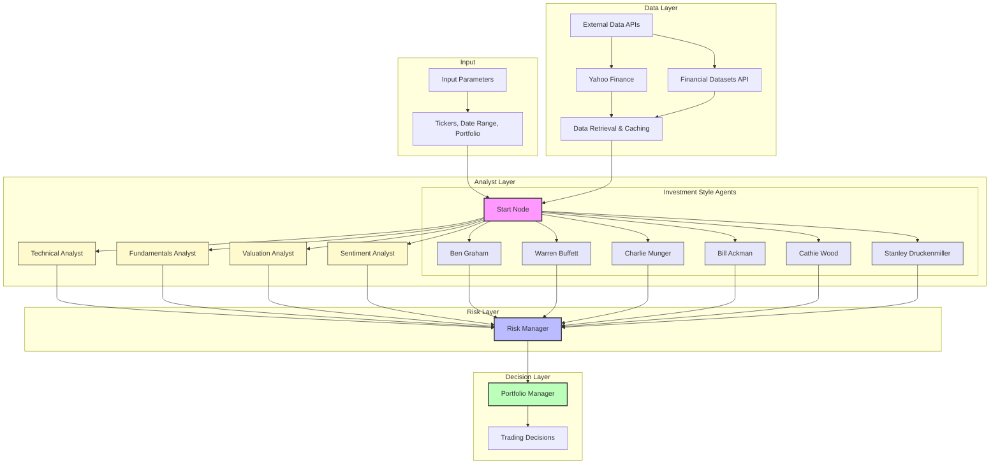
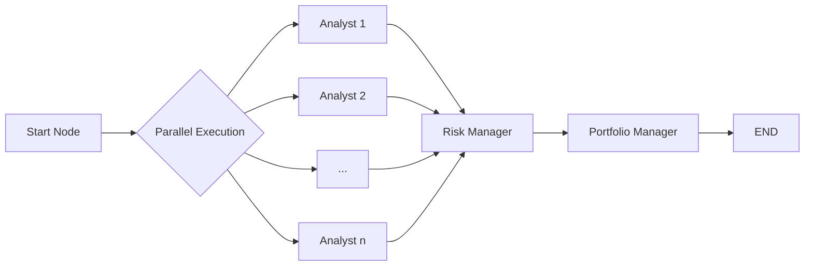
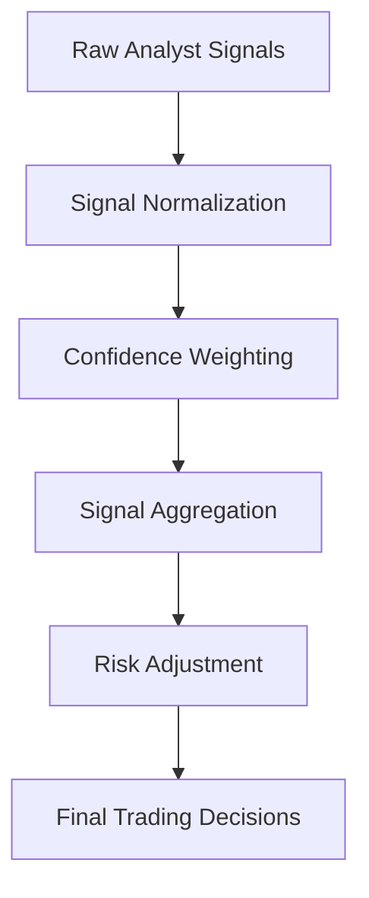

# AI Hedge Fund Agents Documentation

This document provides detailed explanations of each agent in the AI Hedge Fund system, including their investment philosophies, analysis methodologies, and decision-making processes.

## Table of Contents

1. [Investment Style Agents](#investment-style-agents)

   - [Ben Graham (Value Investing)](#ben-graham)
   - [Warren Buffett (Quality Value Investing)](#warren-buffett)
   - [Charlie Munger (Mental Models)](#charlie-munger)
   - [Bill Ackman (Activist Investing)](#bill-ackman)
   - [Cathie Wood (Disruptive Innovation)](#cathie-wood)
   - [Stanley Druckenmiller (Macro Investing)](#stanley-druckenmiller)

2. [Analysis-Based Agents](#analysis-based-agents)

   - [Technical Analyst](#technical-analyst)
   - [Fundamentals Analyst](#fundamentals-analyst)
   - [Valuation Analyst](#valuation-analyst)
   - [Sentiment Analyst](#sentiment-analyst)

3. [Management Agents](#management-agents)

   - [Risk Manager](#risk-manager)
   - [Portfolio Manager](#portfolio-manager)

---

## Investment Style Agents

These agents emulate the investment philosophies and decision-making processes of renowned investors.

### Ben Graham

**File:** `src/agents/ben_graham.py`

**Investment Philosophy:** Classical value investing focused on finding stocks trading below their intrinsic value with a significant margin of safety.

**Key Analysis Methods:**

- **Earnings Stability Analysis:** Evaluates consistency of positive earnings over multiple years (ideally 5+)
- **Financial Strength Analysis:** Assesses liquidity (current ratio ≥ 2), debt levels, and dividend history
- **Graham Valuation Methods:**
  - Net-Net Working Capital: (Current Assets - Total Liabilities) vs. Market Cap
  - Graham Number: √(22.5 × EPS × Book Value per Share)
  - Price/Earnings and Price/Book ratios compared to historical norms

**Decision Process:** Conservative with high emphasis on margin of safety and protection against permanent capital loss rather than pursuing high returns.

### Warren Buffett

**File:** `src/agents/warren_buffett.py`

**Investment Philosophy:** "It's far better to buy a wonderful company at a fair price than a fair company at a wonderful price." Focuses on quality businesses with durable competitive advantages.

**Key Analysis Methods:**

- **Business Quality Assessment:** Evaluates competitive advantages, high return on equity, and pricing power
- **Consistency Analysis:** Looks for predictable, steady earnings growth over time
- **Owner Earnings Calculation:** Net Income + Depreciation - Maintenance CapEx (Buffett's preferred measure of true earnings power)
- **Intrinsic Value Calculation:** Discounted Cash Flow (DCF) analysis using owner earnings and conservative growth rates

**Decision Process:** Seeks businesses with strong economic moats, capable and honest management, and reasonable valuations for long-term holding.

### Charlie Munger

**File:** `src/agents/charlie_munger.py`

**Investment Philosophy:** Mental models-based investing focusing on businesses with sustainable competitive advantages, capable management, and fair prices.

**Key Analysis Methods:**

- **Mental Models Analysis:** Applies various mental models from multiple disciplines
- **Competitive Advantage Assessment:** Evaluates the durability of a company's moat
- **Management Quality Analysis:** Assesses management's capital allocation capabilities and incentive alignment
- **Latticework of Models:** Integrates insights from psychology, engineering, mathematics, and other disciplines

**Decision Process:** Emphasizes avoiding stupidity over seeking brilliance, with a strong focus on risk identification and psychological biases.

### Bill Ackman

**File:** `src/agents/bill_ackman.py`

**Investment Philosophy:** Activist investing focused on finding undervalued companies with potential for significant operational or structural improvements.

**Key Analysis Methods:**

- **Business Quality Analysis:** Assesses underlying business quality, cash flow generation, and growth potential
- **Activism Potential:** Evaluates opportunities for corporate governance improvements, operational restructuring, or capital allocation changes
- **Catalyst Identification:** Looks for specific events or changes that could unlock shareholder value
- **Concentrated Position Analysis:** Determines appropriate position sizing for high-conviction investments

**Decision Process:** Takes concentrated positions with active involvement to implement changes that increase shareholder value.

### Cathie Wood

**File:** `src/agents/cathie_wood.py`

**Investment Philosophy:** Disruptive innovation investing focused on technologies and companies poised to change the world.

**Key Analysis Methods:**

- **Innovation Assessment:** Evaluates potential for disruptive innovation and scalable technology solutions
- **Market Size Analysis:** Estimates total addressable market (TAM) and growth trajectories
- **Exponential Growth Potential:** Identifies companies with potential for exponential growth
- **Technology Convergence Analysis:** Examines how multiple technologies might converge to create new opportunities

**Decision Process:** Forward-looking, high-growth focus with emphasis on disruptive technological and business model innovations, often accepting higher valuations for growth potential.

### Stanley Druckenmiller

**File:** `src/agents/stanley_druckenmiller.py`

**Investment Philosophy:** Macro-focused investing with concentrated bets on big-picture economic trends and flexibility to adapt positions quickly.

**Key Analysis Methods:**

- **Macroeconomic Analysis:** Evaluates global economic conditions, monetary policy, and major trends
- **Liquidity Flow Assessment:** Tracks money flows and central bank actions
- **Asymmetric Opportunity Identification:** Seeks scenarios with limited downside but substantial upside
- **Market Psychology Analysis:** Evaluates sentiment extremes and contrarian opportunities

**Decision Process:** Highly flexible, concentrated positions based on major macroeconomic themes with willingness to change course rapidly when conditions shift.

## Analysis-Based Agents

These agents focus on specific analytical frameworks rather than emulating individual investors.

### Technical Analyst

**File:** `src/agents/technicals.py`

**Analysis Philosophy:** Price action and chart patterns contain predictive information about future price movements.

**Key Analysis Methods:**

- **Trend Following:** Moving averages, ADX, and other trend indicators
- **Mean Reversion:** Bollinger Bands, RSI, and statistical measures of overextension
- **Momentum Analysis:** Rate of change, relative strength, and momentum oscillators
- **Volatility Analysis:** ATR, Bollinger Band width, and statistical volatility measures
- **Statistical Arbitrage:** Pattern recognition and statistical probabilities

**Decision Process:** Combines multiple technical indicators with appropriate weightings to generate trading signals independent of fundamental business quality.

### Fundamentals Analyst

**File:** `src/agents/fundamentals.py`

**Analysis Philosophy:** Company fundamentals drive long-term stock performance.

**Key Analysis Methods:**

- **Financial Statement Analysis:** Evaluates profitability, growth, and financial health metrics
- **Growth Trend Analysis:** Assesses historical and projected growth rates for key metrics
- **Efficiency Metrics:** Analyzes capital efficiency, return on invested capital (ROIC), and asset utilization
- **Cash Flow Quality:** Evaluates cash conversion cycle and relationship between earnings and cash flow

**Decision Process:** Focuses purely on the operational performance of the business rather than market perception or price action.

### Valuation Analyst

**File:** `src/agents/valuation.py`

**Analysis Philosophy:** Market price and intrinsic value inevitably converge over time.

**Key Analysis Methods:**

- **Multiple-Based Valuation:** P/E, EV/EBITDA, P/S, P/B compared to historical averages and peer groups
- **Discounted Cash Flow Analysis:** Projects future cash flows and discounts to present value
- **Relative Valuation:** Compares valuation metrics across sector peers
- **Margin of Safety Calculation:** Determines discount to intrinsic value

**Decision Process:** Seeks opportunities where significant gaps exist between current market price and calculated intrinsic value.

### Sentiment Analyst

**File:** `src/agents/sentiment.py`

**Analysis Philosophy:** Market sentiment and behavioral factors influence price movements.

**Key Analysis Methods:**

- **Insider Trading Analysis:** Evaluates patterns in insider buying and selling
- **News Sentiment Analysis:** Assesses positive/negative sentiment in company news
- **Social Media Sentiment:** Gauges public perception and discussion trends
- **Institutional Positioning:** Tracks changes in institutional ownership

**Decision Process:** Combines various sentiment indicators to identify potential price catalysts driven by market perception rather than fundamentals.

## Management Agents

These agents handle portfolio construction and risk management decisions.

### Risk Manager

**File:** `src/agents/risk_manager.py`

**Philosophy:** Effective risk management is essential for long-term investment success.

**Key Functions:**

- **Position Sizing:** Determines appropriate position sizes based on risk metrics
- **Correlation Analysis:** Evaluates portfolio correlation and diversification benefits
- **Drawdown Projection:** Models potential loss scenarios and maximum drawdowns
- **Risk Adjusted Return Analysis:** Calculates risk-adjusted metrics like Sharpe ratio

**Decision Process:** Sets position limits and risk parameters for the portfolio manager to follow, ensuring overall portfolio risk remains within acceptable bounds.

### Portfolio Manager

**File:** `src/agents/portfolio_manager.py`

**Philosophy:** Portfolio construction should synthesize all available signals while managing overall risk.

**Key Functions:**

- **Signal Aggregation:** Combines and weights signals from all analyst and investment style agents
- **Capital Allocation:** Determines optimal allocation of capital across investment opportunities
- **Trading Decision Generation:** Converts analyses into actionable buy/sell/hold decisions
- **Position Management:** Manages entry and exit timing, order types, and position sizing

**Decision Process:** Makes the final investment decisions, considering all agent inputs while respecting risk parameters to generate specific trading actions.

---

## System Integration

The agents work together as part of a comprehensive investment decision system:

1. **Data Collection:** Financial metrics, price data, news, and insider trades are gathered for each ticker

2. **Individual Analysis:** Each agent performs its specialized analysis

3. **Signal Generation:** Agents generate investment signals with confidence levels

4. **Risk Assessment:** Risk Manager evaluates portfolio implications

5. **Decision Synthesis:** Portfolio Manager integrates all signals to make final trading decisions

This multi-agent approach provides diverse perspectives and analysis methods, potentially reducing individual biases and blind spots inherent in any single investment approach.

## Agent Orchestration

The following diagrams illustrate how agents are orchestrated within the system:

### System Flow Diagram

### Agent Communication Pattern

The system uses a directed acyclic graph (DAG) to manage agent workflow:

### Signal Aggregation Process

### Data Flow Description

1. **Initialization**
   - System receives input parameters (tickers, date range, portfolio state)
   - Data retrieval layer fetches required financial data from APIs

2. **Parallel Analysis**
   - Analysis is distributed across multiple specialized agents
   - Each agent operates independently using its specific methodology
   - Results are collected from all agents

3. **Risk Assessment**
   - Risk Manager receives all analyst signals
   - Performs position sizing and risk calculations
   - Sets position limits based on risk parameters

4. **Decision Making**
   - Portfolio Manager receives risk-adjusted signals
   - Weighs all inputs according to confidence levels
   - Generates final trading decisions (buy/sell/hold with quantities)

### State Management

The system maintains a shared state object that contains:

1. **Input Data**
   - Tickers, date ranges, portfolio composition

2. **Intermediate Results**
   - Analyst signals with confidence levels
   - Risk parameters and position limits

3. **Final Output**
   - Trading decisions with quantities and reasoning

All agents read from and write to this shared state, creating a cohesive decision-making process that leverages diverse investment approaches while maintaining coordinated risk management.
